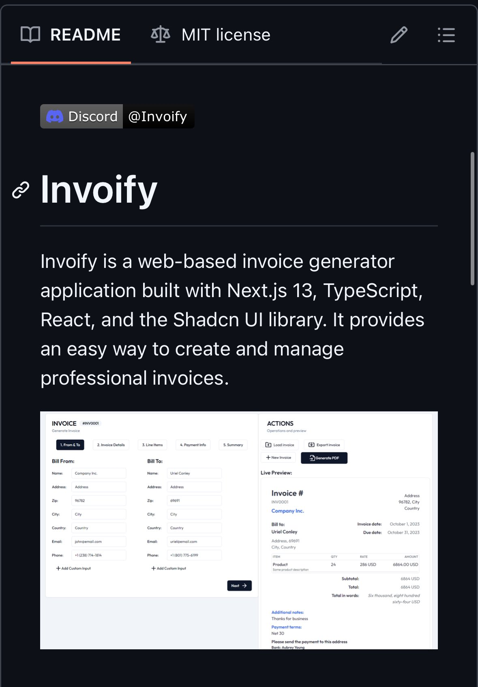

# 🖼️ Bettercaption

Bettercaption is a web-based AI-powered image enhancement and social media sharing platform built with React.js, TypeScript, and the Shadcn UI library. It provides intelligent content creation tools with cross-platform functionality.

## ✨ Features

- 🤖 AI-powered image enhancement and caption generation
- 📱 Cross-platform image upload and sharing
- 🌓 Dark mode and theme customization
- 💳 Tiered pricing model with flexible service levels
- 🔒 Secure user authentication
- 📊 Analytics and performance tracking

## 🎯 Key Technologies

- **Frontend**: React.js with TypeScript
- **UI Framework**: Shadcn UI + Tailwind CSS
- **Backend**: Node.js + Express
- **AI Integration**: OpenAI API
- **Authentication**: Secure session management
- **Database**: PostgreSQL

## 📸 Preview

## 🚀 Getting Started

1. Clone the repository
2. Install dependencies: `npm install`
3. Set up environment variables
4. Run the development server: `npm run dev`

## 📄 License

MIT License - see the [LICENSE](LICENSE) file for details.